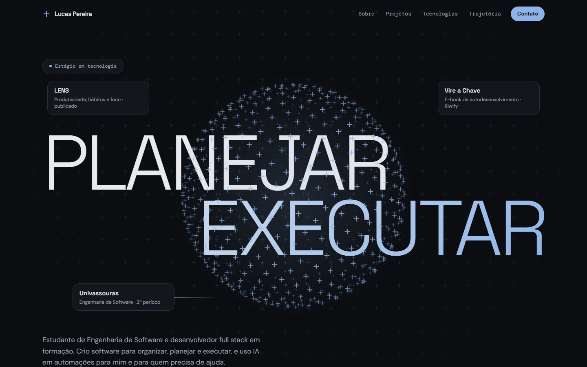

# Portfólio · Lucas Pereira

Portfólio pessoal de **Lucas Pereira**, estudante de Engenharia de Software (Univassouras) e desenvolvedor full stack em formação, em busca de estágio em tecnologia.

**Site:** <https://portifolio-nine-livid-23.vercel.app>



## O que é

Uma página única, em português, que apresenta quem sou, os projetos que construí e o que já usei em cada um. A ideia central é a **honestidade do conteúdo**: nada é exibido sem uma fonte (currículo, repositório público, página publicada do projeto ou confirmação minha). Por isso o site não promete experiência profissional que não tenho, não lista tecnologias que nunca usei e não mostra métricas decorativas.

Seções: **Hero**, **Sobre**, **Projetos** (estudos de caso), **Tecnologias** (separadas entre "usei em projetos" e "estudando"), **Trajetória** (formação, cursos e idiomas) e **Contato** (e-mail e links, sem formulário).

A direção visual é grafite com azul-gelo e uma grade de cruzes "+" como motivo. Foi inspirada, apenas como direção artística, no shot "AI SaaS Agent Landing — Futuristic Hero" do Dribbble; nenhum elemento foi copiado.

## Tecnologias

| Uso | O que |
|---|---|
| Framework | Next.js 15 (App Router) e React 19, com Server Components |
| Linguagem | TypeScript |
| Estilo | Tailwind CSS 3 e variáveis CSS (tokens de cor em `tailwind.config.ts` e `app/globals.css`) |
| Fontes | `next/font` com Space Grotesk (títulos), DM Sans (texto) e DM Mono (rótulos) |
| Imagens | `next/image` para as capturas dos projetos; `next/og` para a imagem de compartilhamento e o ícone do iOS |
| Animação | CSS puro (entradas e rolagem) e um canvas 2D próprio para a esfera do hero, sem biblioteca de animação nem three.js |
| Qualidade | ESLint 9 (`next/core-web-vitals` e `next/typescript`) |
| Hospedagem e métricas | Vercel, com `@vercel/analytics` e `@vercel/speed-insights` |

## Como rodar

Requer Node.js 20.11 ou superior. O Next.js aceita a partir do 18.18, mas o `eslint.config.mjs` usa `import.meta.dirname`, que só existe a partir do 20.11.

```bash
npm install
npm run dev      # http://localhost:3000
```

Outros comandos:

```bash
npm run build    # build de produção
npm start        # serve o build
npm run lint     # ESLint
```

Não há testes automatizados.

### Variáveis de ambiente (opcionais)

Copie `.env.example` para `.env.local` se quiser usar alguma. Sem elas, o site funciona.

| Variável | Para quê |
|---|---|
| `GITHUB_TOKEN` | Eleva o limite da API do GitHub (de 60 requisições por hora). Use um token com o **menor escopo possível** (leitura de dados públicos). Nunca versione. |
| `NEXT_PUBLIC_SITE_URL` | URL pública do site (canonical, Open Graph, sitemap). Sem ela vale o endereço atual na Vercel. |

## Estrutura

```
app/            layout (metadados e dados estruturados), página, sitemap, robots, imagem de compartilhamento e ícones
components/     seções e peças de interface (Server Components; só Nav, HeroSphere e PlusSphere rodam no cliente)
content/        todo o texto e os dados exibidos, com a fonte de cada item
lib/            busca de repositórios no GitHub (getRepos), junção com os projetos curados e URL do site
public/         capturas das páginas dos projetos (public/projects)
types/          tipos da resposta da API do GitHub
docs/           notas de design (design.md) e a imagem de pré-visualização
```

### Como atualizar o conteúdo

O conteúdo fica em `content/`, não nos componentes:

- `site.ts`: identidade, texto do hero, SEO, contatos e como trabalho.
- `projects.ts`: projetos exibidos. Cada um traz problema, destaques técnicos, stack, links e status (`publicado`, `em-desenvolvimento`, `so-codigo` ou `estudo-nao-publicado`). Um projeto só aparece se `visible: true`.
- `skills.ts`: tecnologias, cada uma com o nível (`projetos` ou `estudando`) e onde foi usada.
- `timeline.ts`: formação, cursos e idiomas.

Todo item precisa declarar de onde veio a informação no campo `source` (o TypeScript recusa um item sem fonte). O GitHub **não decide** o que aparece; ele só complementa os projetos com a data do último envio de código, e se a API falhar o site continua funcionando.

## Qualidade medida

Lighthouse 12 em build de produção local, em 2026-10-09:

| | Desempenho | Acessibilidade | Boas práticas | SEO |
|---|---|---|---|---|
| Celular | 95 | 100 | 96 | 100 |
| Desktop | 100 | 100 | 96 | 100 |

As boas práticas perdem pontos só pelos scripts do Vercel Analytics, que não existem fora da Vercel. O site também respeita `prefers-reduced-motion`, tem navegação completa por teclado, link para pular ao conteúdo, contraste mínimo de 4.5:1 e o texto principal visível antes do JavaScript carregar.

## Publicação

O site é publicado na Vercel. Alterações só vão ao ar depois de revisadas e aprovadas; o trabalho de desenvolvimento acontece em branches.

## Contato

Os contatos estão na própria página: <https://portifolio-nine-livid-23.vercel.app/#contato>. Também em [GitHub](https://github.com/lucas04501) e [LinkedIn](https://www.linkedin.com/in/lucaspds9/).
