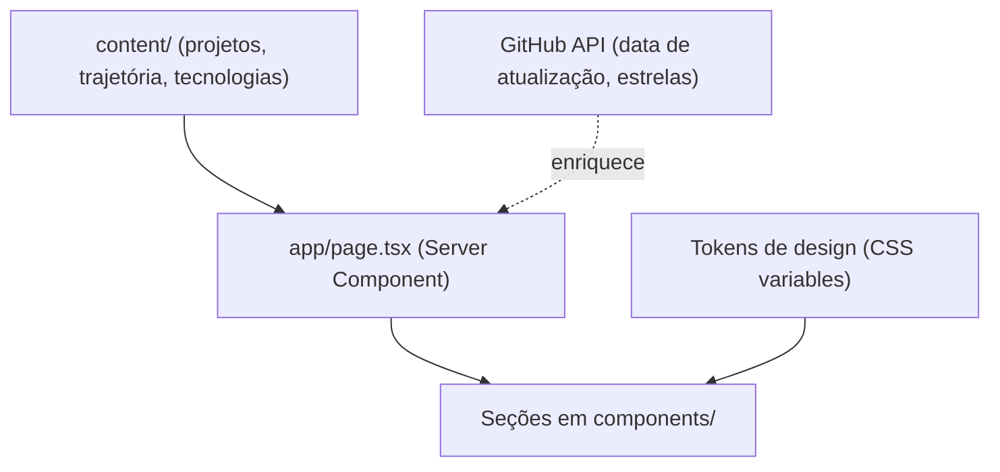

# Design — direção visual e arquitetura

Estado: **planejado**. Descreve o redesenho em curso; nada aqui está implementado ainda, salvo o que for indicado.

## Direção visual
Referência de direção artística: shot do Dribbble "AI SaaS Agent Landing — Futuristic Hero" (hero com tipografia gigante atravessada por um objeto central, rótulos de vidro flutuantes, cartões sobrepostos na base e grade de cruzes finas). Usada só como inspiração; não se reproduz objeto, texto nem layout.

**Conceito:** "estrutura sob a superfície". A malha de cruzes "+" é o motivo do site (fundo, marcadores, foco).

| Elemento | Decisão |
|---|---|
| Fundo | Grafite (`#0B0D10`, `#12151A`, `#1A1E25`), gradiente radial frio, luz de borda pontual. Sem neon |
| Acento | Azul-gelo `#8DB4E8`, único |
| Texto | `#E8EAED` e `#9AA3AF`; contraste mínimo 4.5:1 (o cinza atual `#5a5a54` falha e sai) |
| Tipografia | Display largo e leve + mono para metadados, via `next/font` (família a definir) |
| Hero | Nome e papel em tipografia gigante, objeto próprio em SVG/canvas leve, etiquetas com fatos verificáveis, cartões de base com borda inclinada |
| Movimento | Entrada escalonada curta e hover discreto; tudo respeita `prefers-reduced-motion` |
| Evitar | Cartões idênticos repetidos, emoji como ícone, estatísticas decorativas, badges, 3D pesado |

## Seções
Hero → Sobre → Projetos (estudos de caso) → Tecnologias (por nível de evidência) → Trajetória (só o confirmado) → Contato (links e e-mail, sem formulário).

## Arquitetura de conteúdo

O conteúdo curado em `content/` será a fonte de verdade e decide o que aparece. A API do GitHub (`lib/github.ts`) só complementa e, se falhar, o site continua funcionando. Hoje a lista de projetos vem direto da API, ordenada por estrelas, e isso será substituído.

## Acessibilidade (requisitos)
Teclado completo com foco visível, link "pular para o conteúdo", `lang="pt-BR"`, `aria-hidden` em elementos decorativos, contraste validado, `prefers-reduced-motion`, links externos identificados.
