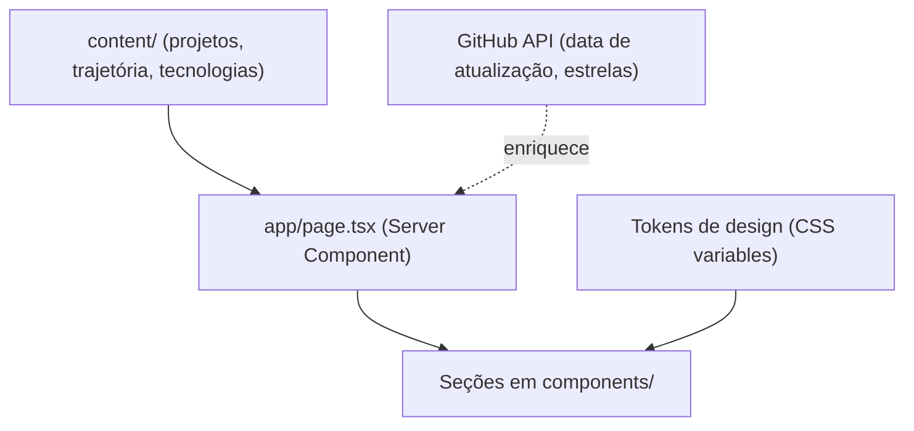

# Design — direção visual e arquitetura

Estado: **em andamento**. Implementado: tokens de cor, fontes, grade "+", foco visível, `prefers-reduced-motion`, link "pular para o conteúdo" e navegação (etapa 6); hero com palavras gigantes, esfera de cruzes em canvas, rótulos de vidro e cartões de base (etapa 7); Sobre e Trajetória (etapa 8). Ainda planejado: Projetos, Tecnologias, Contato e SEO (etapas 9 a 11). A entrada ao rolar usa `animation-timeline: view()` (`.scroll-reveal`) onde há suporte.

Regra de entrada de elementos: animações em **CSS** (`.reveal`, `.rise` em `globals.css`), nunca `opacity: 0` vindo de JavaScript no conteúdo principal. O texto precisa estar visível antes da hidratação e sem JS. O que é o maior elemento da tela (LCP) usa só deslocamento (`.rise`).

## Direção visual
Referência de direção artística: shot do Dribbble "AI SaaS Agent Landing — Futuristic Hero" (hero com tipografia gigante atravessada por um objeto central, rótulos de vidro flutuantes, cartões sobrepostos na base e grade de cruzes finas). Usada só como inspiração; não se reproduz objeto, texto nem layout.

**Conceito:** "estrutura sob a superfície". A malha de cruzes "+" é o motivo do site (fundo, marcadores, foco).

| Elemento | Decisão |
|---|---|
| Fundo | Grafite (`#0B0D10`, `#12151A`, `#1A1E25`), gradiente radial frio, luz de borda pontual. Sem neon |
| Acento | Azul-gelo `#8DB4E8`, único |
| Texto | `text-1 #E8EAED`, `text-2 #9AA3AF`, `text-3 #8791A0`. Contraste mínimo 4.6:1 sobre qualquer fundo (o `#5a5a54` antigo dava 2,1 a 2,8) |
| Tipografia | Space Grotesk nos títulos (`font-display`), DM Sans no texto, DM Mono nos metadados, todas via `next/font`. Alternativas avaliadas: Sora e Geist |
| Utilitários | `.plus-grid` (grade de cruzes, só em elemento decorativo com `aria-hidden`), `.glass` (painel de vidro), `.skip-link`, foco `:focus-visible` global |
| Hero | Nome e papel em tipografia gigante, objeto próprio em SVG/canvas leve, etiquetas com fatos verificáveis, cartões de base com borda inclinada |
| Movimento | Entrada escalonada curta e hover discreto; tudo respeita `prefers-reduced-motion` |
| Evitar | Cartões idênticos repetidos, emoji como ícone, estatísticas decorativas, badges, 3D pesado |

## Seções
Hero → Sobre → Projetos (estudos de caso) → Tecnologias (por nível de evidência) → Trajetória (só o confirmado) → Contato (links e e-mail, sem formulário).

## Arquitetura de conteúdo

O conteúdo curado em `content/` será a fonte de verdade e decide o que aparece. A API do GitHub (`lib/github.ts`) só complementa e, se falhar, o site continua funcionando. Hoje a lista de projetos vem direto da API, ordenada por estrelas, e isso será substituído.

## Acessibilidade (requisitos)
Teclado completo com foco visível, link "pular para o conteúdo", `lang="pt-BR"`, `aria-hidden` em elementos decorativos, contraste validado, `prefers-reduced-motion`, links externos identificados.
